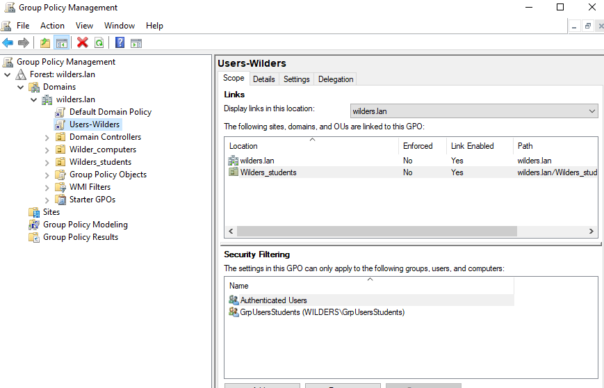
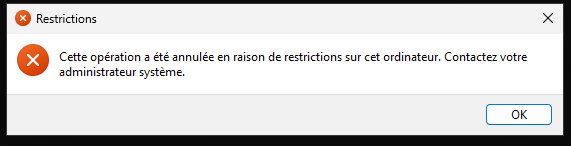

# Active Directory Domain Services - Gestion des Stratégies de Groupe (GPO)

Cette quête a pour objectif de comprendre le fonctionnement des **Stratégies de Groupe (GPO)**, ainsi que leur utilisation pour appliquer des règles de sécurité et de restriction aux utilisateurs.

## Ce qui était demandé
- Comprendre la différence entre :
  - Stratégie de sécurité locale
  - GPO locale
  - GPO Active Directory
- Mettre en place une **stratégie de comptes locale**
- Créer et lier une **GPO Active Directory**
- Appliquer une restriction utilisateur via GPO
- Vérifier l’application effective des stratégies

## Captures (dans `/resources`)

### 1) GPO sur OU `Wilders_Students`et filtrage du groupe `GrpUsersStudents`

### 2) Accès refusé sur le client
