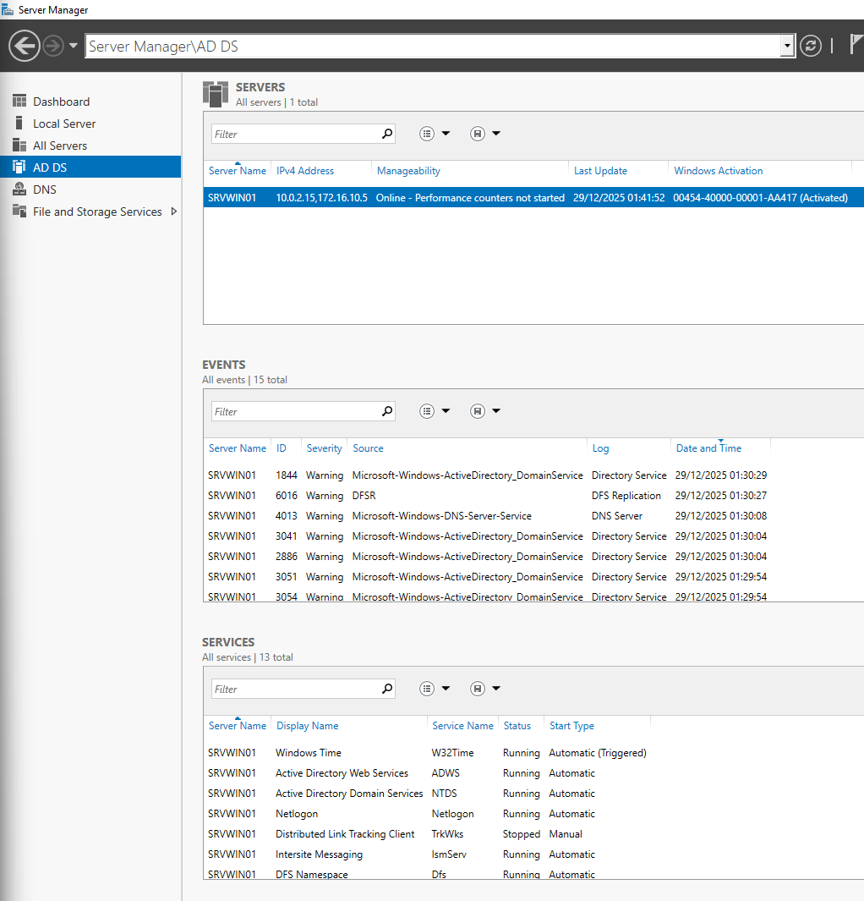
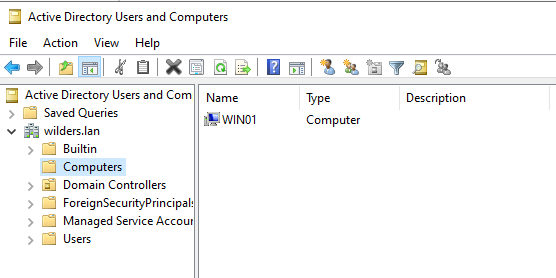

# Active Directory Domain Services - Installation

Cette quête consiste à déployer un serveur DNS sous Windows Server pour permettre la résolution de noms (directe et inverse) sur un réseau local.

## Ce qui était demandé
- Installer du rôle **AD DS**
- Créer une nouvelle forêt : **wilders.lan**
- Ajouter un client dans le domaine
- Vérifier depuis un client :
  - `systeminfo | findstr /i "domaine"` 

## Captures (dans `/resources`)

### 1) Rôle AD DS installé sur Server Manager

### 2) Le client dans le conteneur Computers sur Active directory Users and Computers

