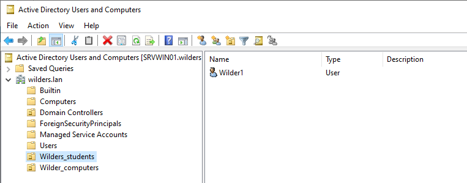
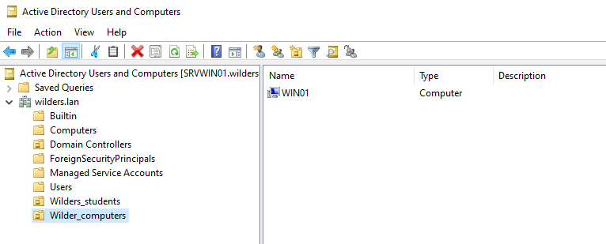
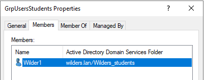
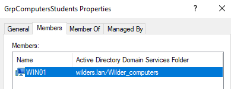
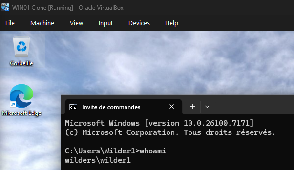

# Active Directory Domain Services - Installation

Cette quête consiste à comprendre l’utilité des Unités d’Organisation (OU) dans Active Directory et savoir les utiliser pour structurer proprement des comptes utilisateurs et des comptes ordinateurs dans un domaine Active Directory.

## Ce qui était demandé
- Créer une OU `Wilders_students`
- Créer une OU `Wilder_Computers`
- Créer un Groupe d'utilisateurs `GrpUsersStudents`
- Créer un groupe d'ordinateurs `GrpComputersStudents`
- Créer un utilisateur `Wilder1`
- Mettre cet utilisateur dans le groupe des utilisateurs et dans l'OU des utilisateurs
- Mettre le client qui a joint le domaine dans le groupe des ordinateurs et dans l'OU des ordinateurs
- Se connecter sur le client avec le compte que tu l'on à créé

## Captures (dans `/resources`)

### 1) OU étudiants sur Active directory Users and Computers

### 2) OU ordinateurs sur Active directory Users and Computers

### 3) Groupe étudiants sur Active directory Users and Computers

### 4) Groupe Ordinateurs sur Active directory Users and Computers

### 5) Connexion Wilder1

